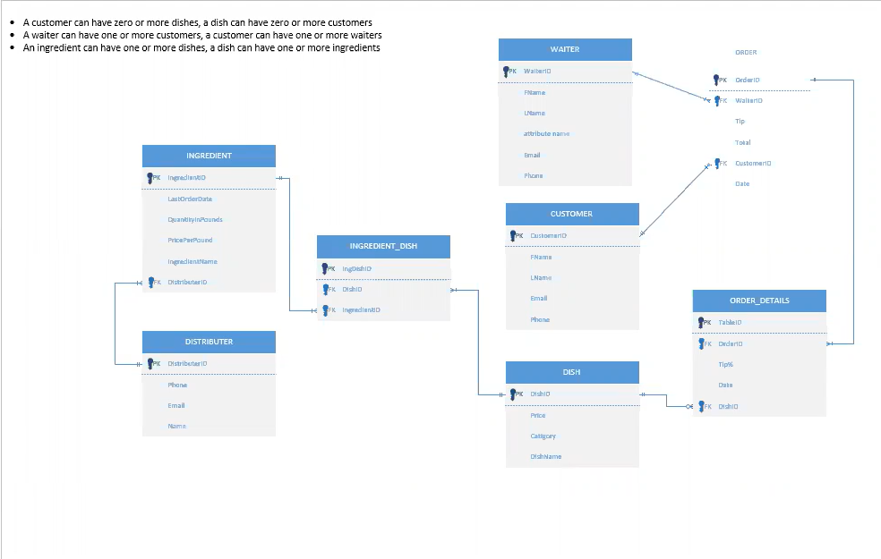

## Daniels Distinction Portfolio
<i>Jack Stevens – March 2024</i>

See my [Resume](Resume_BlueMargin.pdf) and [LinkedIn](https://www.linkedin.com/in/jacklstevens/)

## Education
### Univeristy of Denver, Daniels College of Business
Bachelor of Science Business Administration – Business Information and Analytics, June 2024

<ul>
  <li><b>National Society of Leadership and Success</b>: Candidacy is a nationally recognized achievement of honorable distinction.</li>
  <li><b>Pi Kappa Phi Historian</b>: July 2022-December 2023</li>

### Community Engagement and Leadership

As the Historian of the Epsilon Chi chapter of Pi Kappa Phi, I was responsible for not only alumni outreach and engagement but also designing and creating merchindise and advertisements for events. During my time as the Historian we had many notable achivements from selling out a 700 person venue for a philanthropy concert to growing the chapter by over 70% and becoming the largest fraternity on campus. The only way this was possible was through the teamwork and leadership of the whole executive board, and this oppertunity facilitated personal and professional growth. I further developed my skills in communication, advertising, designing and leading. However, the most rewarding aspect of the role was the growth of the chapter as well as those around me.

 
   

## Skills

<table>
  <tr>
    <th>Tools and Technical Skills</th>
    <th>Certifications</th>
  </tr>
  <tr>
    <td>
     <ul>
        <li>SQL</li>
        <li>Visual Basic</li>
        <li>Python</li>
        <li>R</li>
        <li>Excel</li>
        <li>Microsoft SQL Server Management Studio</li>
        <li>Microsoft Visual Studio</li>
        <li>Tableau</li>
        <li>PowerBI</li>
        <li>C#</li>
        <li>JMP</li>
      </ul>
    </td>
    <td>
     <ul>
        <li><a href = "https://www.credly.com/badges/ded6128e-aefe-48d1-9f1b-a823b63b3a59/public_url">Python 2019</a></li>
        <li><a href = CertExcel.pdf>Microsoft Excel 2019</a></li>
        <li><a href = CertWord.pdf>Microsoft Expert Word 2019</a></li>
        <li><a href = CertPowerPoint.pdf>Microsoft PowerPoint 2019</a></li>
       <li><a href = CertOffice.pdf>Microsoft Office 2019</a></li>
      </ul>
    </td>
  </tr>
  <tr>
    <th>Precice Flight Strengths (Summer 2023)</th>
    <th>Other Skills</th>
 </tr>
 <tr>
   <td>
     <ol>
        <li>Detail Oriented</li>
        <li>Learner</li>
        <li>Teamwork</li>
        <li>Developer</li>
     </ol>
   </td>
   <td>
     <ul>
        <li>AutoCAD Software</li>
        <li>Facilitating</li>
       <li>Problem Solving</li>
     </ul>
   </td>
 </tr>
</table>

## Work Examples
Here I have compiled some of my work highlighting my experiences throughout my undergraduate years. 

  
       Resturant Database Managment Application and Chat Bot:

Below is the application that I created for a resturant database that I created inspired by one of my previous employers, Drake. Drake is a small resturant in Bend, OR and I was a line cook there for many years. Resturants in general are very unorganized and a non data driven industry, which inspired me to try to make them more organized. Below is the ERD for my database followed by the applications home page and a couple of the subsequent pages. I created the database in Microsoft SQL Server and the Application in Visual Studio using C#. The first subsequent page shows how I was able to alter customer data through the application. The next is a page that shows orders by customer selected.
      
   
     

      
My favorite part of this project however was the Chat Bot that I created for Drake that I named "DrakeGPT". This bot was connected to the database and could answer any question that was surrounding the orders, customers, ingredients and dishes.

   
  

        Resturant Database Data Warehouse and Reporting:

For the same database in a different class project, we created a data warehouse in Microsoft SQL Server and relevant reports using VBA and PowerBI. 

   
    

## Internship at Precise Flight (Summer 2023)

During this past summer, I had the ammazing oppertunity to be a information systems intern at Precise Flight in Bend, Oregon. Precise Flight is a aerospace industry leader for many parts of the aircraft being a vital part in the designs of 737's, 747's, Cessnas and much more. During my time there my main goal was to create a vault to hold all of their Engineering Drawings to more carefully be able to keep track of revisions and organization. I completed this task much faster than expected and was rewarded with some very intersting challenges. I was tasked with two Engineering tasks, with no prior experience, that were previously being completed by the mechanical and electrical engineer respectivley. The first task was to find replacements for parts that were going to end of life on the supply chain, however were needed to continue production of our products. By researching and using Artificial Intelegence I navigated supply chain databases to find suitable replacements and recommend them to upper managment. The other project was reciving 3D models of oxygen tubes from aircraft manufactures and overlay an outline of them onto a new Autodesk Inventor file. Ensuring these overlays had the correct angles and bends was essential for out tube benders downstairs to be able to asses their bends before being sent to the manufacturers to be installed on commercial planes. These challenges made me confident that my fast learning and adapting skills can translate to any position or title that I may hold in the future.

